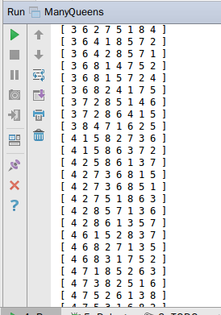

### 1.测试八皇后棋盘

#### 算法与代码

1. 首先我们生成一个棋盘，棋盘用一个一维整型数组表示，并把数组每一项初始化为各不相同数值相差巨大的数。

2. 然后我们开始根据输入摆放棋子。

3. 每摆放一个，就调用judge()函数来判断当前棋盘是否合法，不合法直接中断。

4. 如果全部摆放完还能没有中断，我们就认为棋盘合法。

5. 核心代码如下

   ```java
   /***
    * 根据输入生成棋盘 每摆放一次棋子 检查是否合法
    *
    * QUEENS_NUM 皇后数量
    * checkerboard[] 棋盘数组
    * in 输入读取器
    * @return 摆放是否成功
    */
   private static boolean initCheckerboard() {
     // 初始化棋盘
     for (int i = 0; i < QUEENS_NUM; i++) {
       checkerboard[i] = -QUEENS_NUM * i;
     }
     for (int i = 0; i < QUEENS_NUM; i++) {
       int row = in.nextInt(); // 行
       int col = in.nextInt(); // 列
       checkerboard[row - 1] = col - 1; // 摆放棋子
       if (!judge(col - 1)) {
         return false;
       }
     }
     return true;
   }
   /***
    * 判断皇后的位置是否摆放正确的判断模块
    *
    * checkerboard[] 棋盘数组
    * @param col 摆的位置 哪一列
    * @return 是否合法
    */
   private static boolean judge(int col) {
     for (int i = 0; i < col; i++) {
       if (checkerboard[i] == checkerboard[col]
           || Math.abs(col - i) == 
           Math.abs(checkerboard[col] - checkerboard[i])) {
         return false;
       }
     }
     return true;
   }
   ```

#### 测试结果

1. 第一组数据

    

2. 第二组数据

    

3. 第三组数据

    

### 2.解决八皇后问题

#### 算法与代码

1. 首先我们准备一个棋盘。

2. 然后我们开始往棋盘上摆皇后。

3. 每摆放一个，就调用judge()函数来判断当前棋盘是否合法，不合法则后退。

4. 每次摆完八个，就认为这是一个可行解，输出这个解，回退到上一步。

5. 每次回退到上一步开始尝试下一步的摆法，如果尝试完了所有可行的下一步，也回退到上一步。

6. 当程序结束，也就输出了所有可行解。

7. 核心代码如下

   ```java
   /***
    * 摆放皇后的函数模块 回溯地去尝试所有的可能解
    * queens[] 棋盘数组
    * QUEEN_NUM 皇后数量
    * display() 输出解的函数
    * @param n 刚开始要摆的位置
    */
   private static void check(int n) { // 当前是准备摆第n个皇后
     if (n == QUEEN_NUM) { // 摆完了
       numOfAns++;
       display();
       return; // 返回上一个可行情形，以便寻找下一个解
     }
     for (int i = 0; i < QUEEN_NUM; i++) {
       queens[n] = i; // 尝试放皇后
       if (judge(n)) {
         check(n + 1); // 尝试下一个位置的可能 即使尝试成功后还是会退回来 因此可遍历所有可能解
       }
     }
   }

   /***
    * 判断皇后的位置是否摆放正确的判断模块
    * queens[] 棋盘数组
    * @param n 摆的位置
    * @return 是否合法
    */
   private static boolean judge(int n) {
     for (int i = 0; i < n; i++) {
       if (queens[i] == queens[n] 
           || Math.abs(n - i) ==
           Math.abs(queens[n] - queens[i])) {
         return false; // 只需要检查新放进来的queens[n]
       }
     }
     return true;
   }
   ```

#### 测试结果

测试结果较长，分多个图来表示

 

 

 

 

 

